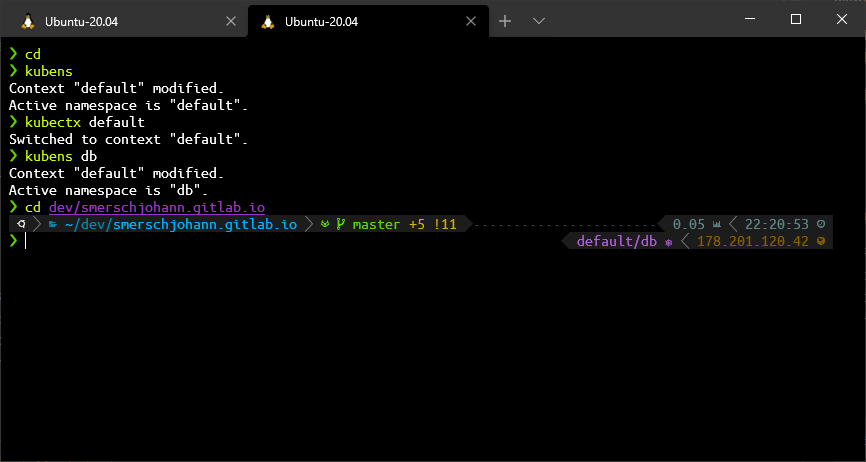
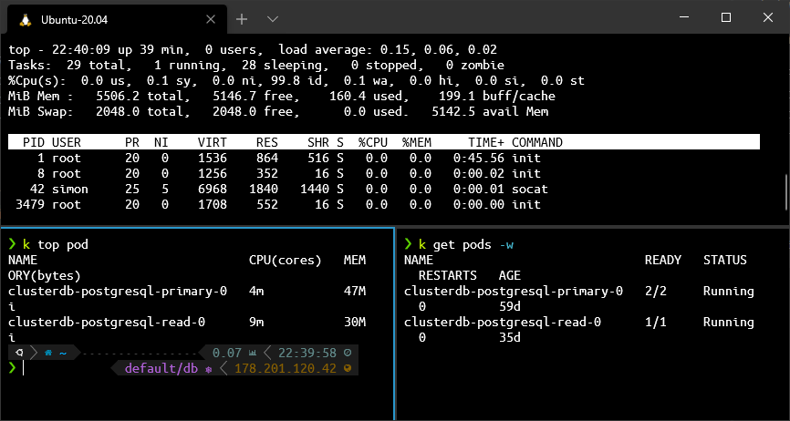

## Overview

In this section I want to show you my current development environment.
While not limited to the terminal, I want to focus on the dev stuff using the terminal. I will add IntelliJ and other interesting aspects that I use for development.

I'm using the ZSH shell with some plugins and additional tools to allow easier interaction with clusters and always know to which cluster I'm connected.

As my work environments are mainly Windows systems, I had to come up with solution that allows me to use this shell on Windows.
Thanks to Microsofts latest invest in that area, it is now possible to have a fully blown Linux environment with nearly no limitations regarding the terminal.





As shown above, the _Windows Terminal_ allows to have multiple tabs, it also allows to split the pane which is a very nice feature. 
Using that you don't need additional tools like _tmux_ or others.





## WSL Installation
You can follow the [Microsoft documentation](https://docs.microsoft.com/de-de/windows/wsl/install-win10) for installation, the steps are clearly documented.
The installation is divided in activation of the WSL *engine* and the WSL *distribution*

Basically the following steps are required:

1. Enable the Windows Feature

```
dism.exe /online /enable-feature /featurename:Microsoft-Windows-Subsystem-Linux /all /norestart
```

2. active the feature for WSL 2 

```
dism.exe /online /enable-feature /featurename:VirtualMachinePlatform /all /norestart
```

3. Reboot your system
4. Update the linux kernel using this [msi package](https://wslstorestorage.blob.core.windows.net/wslblob/wsl_update_x64.msi)
5. Set WSL2 as default environment, this results in the next distribution installation to be either WSL1 or WSL2:

````
wsl --set-default-version 2
````

6. Install a Distribution. For a custom solution with the possibility to share your home directory, have a look at my other post:  

   Alternatively, you can install Ubuntu 20.04 LTS either by the Microsoft Store
   or by [manual download](https://docs.microsoft.com/de-de/windows/wsl/install-manual).
   
   If you made a mistake and want to choose a new directory, 
   you can unregister the distribution by `wsl --unregister <DISTRO-NAME>`. You can get the registered name by `wsl -l`

7. Set a username and password for your distribution and remember your password, as you need that for the `sudo` command.


If you have network issues in your WSL2, please have a look at [WSL2 Firewall issues]()


## Windows Terminal
I recommend the use of the Windows Terminal in combination with the WSL, as it has full font support,
has tabs and pane support, is hugely customizable, and simple looks great.

You can install the Windows Terminal either using the Microsoft Store or by downloading the latest installer from 
the [Github page](https://github.com/microsoft/terminal/releases/).

After installation, you have already a working terminal, to further improve it you can customize it.

### Fonts
My ZSH uses special icons and characters that are not supported in the default font used by the terminal.
To have the best experience, you have to install a font that supports those additional symbols.

One source of such fonts is [Nerdfonts](https://www.nerdfonts.com/), I use the [UbuntoMono NF](https://github.com/ryanoasis/nerd-fonts/releases/download/v2.1.0/UbuntuMono.zip) font in my terminal.
After installation of the _Ubuntu Mono Nerd Font Complete Windows Compatible.ttf_ font, you have to activate it in the terminal by
configuring it accordingly. 

Either add _fontFace_ to a specific profile or add it to the defaults like this:

```json
    "profiles":
    {
        "defaults":
        {
            "fontFace": "UbuntuMono NF"
        },
```

### Scheme
In addition to the font, I also use another scheme, as I don't like the dark red color on black background.
You can choose between a ton of different schemes on [windowsterminalthemes.dev](https://windowsterminalthemes.dev/).

I use a slightly modified version of _VibrantInk_.
Add the theme to the schemes array, just between the brackets.

```json
        {
            // Color Scheme: VibrantInk
            "background" : "#000000",
            "black" : "#878787",
            "blue" : "#44B4CC",
            "brightBlack" : "#555555",
            "brightBlue" : "#0000FF",
            "brightCyan" : "#19D1D8",
            "brightGreen" : "#81EC0D",
            "brightPurple" : "#FF00FF",
            "brightRed" : "#FF6600",
            "brightWhite" : "#E5E5E5",
            "brightYellow" : "#FFD93D",
            "cyan" : "#19D1D8",
            "foreground" : "#FFFFFF",
            "green" : "#CCFF04",
            "name" : "VibrantInk",
            "purple" : "#9933CC",
            "red" : "#FF9900",
            "white" : "#F5F5F5",
            "yellow" : "#FFD93D"
        }
```

To activate it in a profile, you have to add it by using _colorScheme_

```json
{
    "name": "Ubuntu-20.04",
    [..]
    "colorScheme": "VibrantInk"
}
```

### Starting directory
By default, the WSL starts in your Windows home directory. As this is not your home directory in the WSL,
I would change it to exactly that by using the _startingDirectory_ directive. 
This directory must be specified using the UCI path. Note that you can test it by using the Windows Explorer:

```json
{
  "name": "Ubuntu-20.04",
  "source": "Windows.Terminal.Wsl",
  [..]
  "startingDirectory": "//wsl$/Ubuntu-20.04/home/simon/",
}
```
